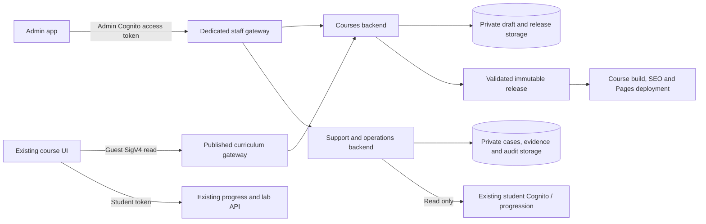

# Admin, course management and dedicated authentication pages

Date: 2026-10-08 · Status: approved for implementation; rollout in progress.

## Agreed scope

Build a separate administration app with the existing Linux Lab visual language, a private staff API, registered-user visibility, support operations, and a dedicated courses backend for learning-path management. Administrator accounts are invitation-only in their own Cognito pool. **MFA is OFF initially**, explicitly parameterized so later deployments cannot silently change this decision. Proposed admin address: `https://admin.linux.jcampos.dev`.

Keep the course at `https://linux.jcampos.dev`, with its current learning, lab, account progression, language/theme, footer and SEO behavior. The approved future changes to that app are dedicated authentication pages, authenticated student support and the minimum data/CI integration needed to read published curriculum. Do not split its landing into another app, move its existing domain, inject admin pages into it, or redesign its lessons.

The course includes a support page only for signed-in students, with ticket creation, their own ticket history and replies. Guests do not see its navigation entry; direct visits redirect to login and return safely afterward. The support API independently validates student tokens and ownership on every ticket, message and evidence operation; hiding the page is not authorization. Staff manage these cases in the separate admin app. Email replies are deliberate staff actions, not automatic test messages. A notification bell and realtime remain later scope.

This document records the approved scope and design. Implementation is underway in separate private repositories; deployment and verification status is tracked separately in `admin-implementation-state.md`.

## References applied

- `~/.claude/skills/app-separation/SKILL.md` and `references/playbook.md`: private admin repository, separate admin identity and gateway, SSM configuration, S3/CloudFront hosting and deployment boundaries.
- `~/.claude/skills/landing-dxp-builder/SKILL.md`, `references/admin-shell.md`, `references/separate-admin-app.md`, `references/online-admin.md`: standalone admin, bilingual chrome, manifest-driven editors, unsaved-change guards, skeletons, revisions and online editing.
- `~/.claude/skills/support-incidents/SKILL.md` and `references/architecture.md`: this is the installed skill containing the requested **support-be** patterns; there is no separate installed skill named support-be. It defines cases, evidence, incident grouping, audit, request references and admin operations.
- `~/.claude/skills/be-builder/SKILL.md`: **mandatory scaffolder for both new backends**, Express standalone manifests, deterministic generation, OpenAPI, explicit dependency injection, packaging and GitHub OIDC deployment assets.
- Workspace UI UX Pro Max and `design-system/comandos-linux/MASTER.md`: course-consistent interface, light/dark contrast, responsive navigation and accessible feedback.
- Tsuru reference: `../Tsuru-CR/fe/pos-system/src/components/layout/{AuthLayout,AuthNavbar}.tsx`, `src/pages/{Login,Register,ForgotPassword,ResetPassword}.tsx`, `src/components/common/PasswordStrengthIndicator.tsx`, and `src/routePaths.ts`.

Scope overrides the broader skill recipes: no wholesale landing/app separation; no PostgreSQL, Drizzle database runtime or Alembic migrations; no MFA activation. Hosted editing requires authentication, unlike the local-only DXP variant. The admin must never have an unauthenticated localhost bypass against production data.

## 1. Current findings and compatibility constraints

| Existing behavior | Evidence | Planning consequence |
|---|---|---|
| Account, sign-in, registration and recovery share the normal course shell | `src/features/Account.tsx`, `SignIn.tsx`, `Register.tsx`, `src/main.tsx` | Separate route/layout trees; retain account tools outside auth forms |
| Registration/reset have no confirmation field or live requirements meter | `Register.tsx`, `SignIn.tsx` | Shared password-policy validator, confirmation and strength/checklist component |
| Cognito requires 12 characters, upper/lowercase, number and symbol | `backend/infra/cognito.yml` | Adapt Tsuru's pattern without copying its weaker eight-character minimum |
| Lessons, courses and workshops are static imports | `src/app/content.ts` | Add a typed curriculum repository/adapter with bundled and last-valid fallback |
| Progress scoring/validation has separate static copies | `src/services/progress.ts`, `backend/service/src/models/ProgressSchema.ts` | A publish cannot introduce IDs or scoring rules the progress API does not recognize |
| Existing backend currently pins course source to `5716ccc…` | `backend/docs/course-source.json` | Baseline from exact frontend and backend refs; compare actual content digests rather than assuming main == deployed rules |
| Guest validators and packages live in the EC2 image; backend checks active path membership | `backend/service/src/labs/{AwsLab,LabLifecycle}.ts`, lab image manifest | Structural or exercise changes require a compatible backend/image release; active labs retain their original release |
| SEO build derives routes and HTML from bundled JSON | `scripts/prerender-seo.mjs`, `scripts/check-seo.mjs` | Build, sitemap and runtime must use the same immutable curriculum release; dynamic new routes alone are insufficient on Pages |
| Existing SSM loader reads exactly ten public keys | `scripts/load-ssm.mjs` | Extend explicitly, including SDK's ten-name GetParameters batch limit or paginated path loading; never just append an eleventh name to the existing call |
| Public JSON includes legacy sources and translations | all `src/data/*.json` | Inventory every file; preserve source mappings, hashes, historical examples and downloads |

Baseline inventory: 6 learning paths, 4 workshops, 44 bilingual lessons, 40 Linux exercise mappings, 4 external GitHub exercises, 28 original examples and 18 preserved source documents. Capture these counts and current hashes again at implementation start; counts alone are not content parity.

## 2. Application, repository and gateway boundaries

| Boundary | Proposed repository | Hosting / domain | Owns |
|---|---|---|---|
| Existing course | `chepelcr/Comandos-linux` · public | Existing GitHub Pages / `linux.jcampos.dev` | Student interface, dedicated auth pages, bundled curriculum fallback, SEO |
| New admin frontend | `chepelcr/linux-lab-admin` · private | Private S3 origin + CloudFront/OAC / `admin.linux.jcampos.dev` | Staff UI, curriculum editing, users, cases, incidents and diagnostics |
| New courses backend | `chepelcr/linux-lab-courses-backend` · private | Node 24 zip Lambda | Drafts, revisions, assets, immutable curriculum releases, publication/rollback |
| New support/operations backend | `chepelcr/linux-lab-support-backend` · private | Node 24 hybrid zip Lambda | User-directory read adapter, support cases/messages/evidence, audit, incidents/error catalog |
| Existing learner backend | `chepelcr/linux-lab-backend` · private | Existing progress/lab Lambdas and gateway | Student identity, progression, scoring, lab lifecycle; compatible release support and observability only |
| Existing email backend | `chepelcr/linux-lab-cognito-templates` · private | Existing resolver/templates | Student mail; extend deliberately for staff invitations/recovery without replacing the student pool trigger |

Do not create these repositories during planning. On implementation, place new checkouts in ignored independent folders, never vendor them into the public course repository. Keep an explicit boundary README and per-repo AGENTS/CLAUDE guidance. There is no new SQL database.

Gateways are separate security boundaries:

1. **Existing student gateway** stays student-pool authenticated and contains no `/api/admin/**` routes.
2. **Staff gateway** at proposed `admin-api.linux.jcampos.dev` contains only allowlisted `/api/admin/**` routes, routed to the courses or support Lambda. It accepts only the new admin pool/client. Explicit unauthenticated OPTIONS; all data methods authorized.
3. **Published curriculum gateway** at proposed `courses-api.linux.jcampos.dev` exposes read-only `/api/public/courses/**`, with a narrow Cognito identity-pool guest role/SigV4 per the app-separation pattern. Guests can read published curriculum only; no draft, history, support or personal data.
4. A separate authenticated student support gateway uses the existing student Cognito pool and exposes only own-ticket operations. Do not mix student access into the staff gateway. Derive ownership from the verified token subject, never from a browser-provided user ID.

Here, “private admin API” means **authenticated staff-only data access over an HTTPS endpoint reachable by the admin browser**. An AWS VPC-only private API would require VPN/another access layer and is not the default browser architecture. The S3 origin and API data are private; CloudFront may serve the nonsensitive login shell/assets before sign-in. Hiding assets or using noindex is not authorization. [AWS private API distinction](https://docs.aws.amazon.com/apigateway/latest/developerguide/apigateway-private-apis.html).

## 3. Dedicated main-app authentication pages

### Route/layout map

| Route | Layout / responsibility |
|---|---|
| `/login` | AuthLayout; email + current password; registration and recovery links |
| `/register` | AuthLayout; email + new password + confirmation; existing unchecked privacy/terms consents |
| `/verify-email` | AuthLayout; confirmation code, resend and next action |
| `/forgot-password` | AuthLayout; request recovery code with clear neutral feedback |
| `/reset-password` | AuthLayout; code + new password + confirmation + policy feedback |
| `/set-password` | AuthLayout; invitation/temporary-password challenge, confirmation and policy feedback |
| `/auth/challenge` | AuthLayout; any supported Cognito challenge, with restart guidance after refresh |
| `/account` and `/settings` | Normal course layout; account management or guest export/reset/preferences; no embedded sign-in/register forms |

Create `src/components/auth/{AuthLayout,AuthHeader,AuthCard,PasswordField,PasswordStrengthIndicator,AuthErrorNotice}.tsx`, `src/features/auth/*`, `src/app/route-paths.ts` and a shared `src/app/password-policy.ts` (or policy JSON + pure evaluator). Keep router/provider responsibilities explicit. Reuse current primitives, inline flag icons, themes and transitions; do not import Tsuru's POS-specific organization, profile, gender, billing or notification flows.

AuthLayout has a compact brand/home header, CR/USA switch, light/dark switch and focused centered form. Registration may have a restrained course introduction aside on wide screens; form comes first on phones. No learning sidebar, terminal or full course navigation inside auth pages. Minimal privacy/terms/Pacific Code Labs links stay available. Preserve the existing one-line phone header and reduced-motion behavior. Language/theme changes cover the auth header too; form/page transitions leave the auth header mounted.

Use native Amplify SRP entirely on this domain. Preserve all existing confirmation, resend, recovery and temporary-password flows and branded emails. Existing `/account` bookmarks still work. Navbar/inline-lab guest sign-in actions go to `/login`; authenticated profile actions go to `/account`. Direct auth URLs must receive generated 200 HTML with `noindex, follow`, proper titles and no sitemap entry.

Store a validated same-origin return path in router state with short-lived session fallback; **no email, password, confirmation code, tokens or return-path query parameters in URLs**. Reject external/protocol-relative paths and auth-loop return targets. Keep secret values in component memory only; reset on successful use, navigation and logout. A refreshed interrupted Cognito challenge restarts safely rather than persisting passwords.

Keep the auth/progress providers stable above both layout trees. After sign-in, resolve the existing local-vs-online progress choice before continuing to the intended lesson. Sign-in must never silently choose a copy or launch EC2; returning to a lesson still requires an explicit Begin lab action. Logout must continue terminating active labs before credentials are cleared. Guest progress export/reset must remain available after moving forms out of `/account`.

### Password validation and strength feedback

Adapt Tsuru's **five-rule meter and checklist**, with translated labels and text/icons beyond color:

- Student policy remains minimum **12** characters, lowercase, uppercase, digit and Cognito-supported symbol. Do not count arbitrary Unicode/whitespace as an accepted symbol merely because Tsuru's regex uses `[^a-zA-Z0-9]`; align with the actual Cognito rules.
- Proposed staff policy: minimum 14 with the same complexity classes; policy is separate and explicit. MFA remains OFF.
- Levels follow the reference: 0 rules = very weak/empty; 1–2 = weak; 3–4 = good; 5 = strong. Label it as requirements feedback; rule count is not a cryptographic entropy estimate.
- Require all policy rules and exact confirmation equality for **registration, reset and setting a new password**. Share one validator between the checklist, submit checks and error mapping. Cognito remains authoritative.
- Login validates email and a nonempty password, **not** the new-password policy; never reject an otherwise valid existing password on the client.
- Password and confirmation have independent show/hide buttons, correct autocomplete, paste/password-manager support and accessible labels. Do not trim or normalize password values.
- Translate inline errors, link them through `aria-describedby` / `aria-invalid`, and focus the first invalid field or error summary after submission. Revalidate gently on blur/change. Avoid announcing every keystroke.
- Do not persist confirmation or send it to Cognito. Clear password fields after successful/failed challenge transitions as appropriate; never log credentials.
- Retain privacy/terms links and consent versions. Plan an identity-backend registration consent record with confirmed subject, policy versions and server timestamp; do not invent historic consent for existing users or break CustomMessage wiring. Owner review of policy/evidence requirements remains a rollout input.

[Reference Cognito password rules](https://docs.aws.amazon.com/cognito/latest/developerguide/managing-users-passwords.html), [Amplify multi-step sign-in](https://docs.amplify.aws/react/frontend/auth/sign-in/).

## 4. Admin experience and component mapping

Use React + Vite + TypeScript, ES/EN, existing course typography/palette, light/dark only, soft transitions and full keyboard support. Start with an admin-local UI package holding versioned copies/adaptations of the course design tokens/primitives, with source commit documented. Do not restructure the existing course to extract a new public design-system repo in this scope.

| Admin route / area | Main components | API / ownership |
|---|---|---|
| `/login`, `/forgot-password`, `/reset-password`, `/set-password` | Staff AuthLayout, PasswordField, policy meter | Separate invitation-only admin Cognito pool; no public registration |
| `/` | OverviewCards, recent activity, operational status | Aggregated bounded overview request |
| `/users`, `/users/:userId` | UserTable, UserDetailDrawer, ProgressSummary | Support backend read adapter; existing Cognito and S3 remain authoritative |
| `/courses`, `/courses/:courseId` | PathList, BilingualPathEditor, LessonOrderEditor | Courses backend drafts |
| `/lessons/:lessonId`, `/workshops/:workshopId` | LessonEditor, bilingual steps, ExercisePreview | Typed draft DTOs and existing IDs |
| `/content/:documentKey` | Manifest-driven schema editor / read-only JSON explorer | Complete inventory of curriculum, author/footer/legal/rewards/locales and historical files |
| `/versions`, `/releases/:releaseId` | RevisionTimeline, Diff, ReleaseChecklist, RollbackDialog | Immutable revisions and release state machine |
| `/media` | AssetLibrary, MediaPicker, upload activity/progress | Courses media upload service; no arbitrary object keys |
| `/support`, `/support/:ticketId` | TicketTable, Conversation, Status/Priority/AssigneeDrawer, EvidenceViewer | Support backend; internal case notes first |
| `/incidents`, `/incidents/:incidentId` | IncidentTable, scrubbed occurrence timeline, resolve/reopen | Support event consumer |
| `/audit`, `/errors`, `/diagnostics` | AuditTable, ErrorCatalog, ContentCoverage, service health | Paginated scrubbed data and manifest diagnostics |

Reusable shell: AdminLayout, collapsible grouped AdminSidebar, fixed AdminHeader, PageHeader, shared accessible Drawer/Dialog, TableSkeleton/DetailSkeleton/FormSkeleton, StatusChip, ActivityBar, BilingualField, EnumSelect, DirtyChangesGuard, PreviewPane and SaveStatus.

Sidebar and topbar stay outside page transitions. Only the content region scrolls on desktop; long sidebar groups can scroll internally. Mobile uses an animated full-height sidebar drawer and full-height detail/editor drawers. Switch admin language in place: never navigate to the learner website or drop a dirty draft. All chrome, empty states, labels, errors, dialogs and enum labels come from ES/EN translations. Save/publish/error states use distinct labels and icons.

Every content document is in one manifest driving its sidebar entry, editor/explorer route, versions/download row and diagnostics. Historical source documents, original examples and source mappings are read-only. Generated inventories are read-only too. New original-material changes require an explicit content migration, not a general editor toggle. User-facing curriculum fields are editable as bilingual drafts; technical validator/build/image fields are restricted and reviewed.

Guard dirty edits across sidebar navigation, browser Back and tab close. Conflict responses never silently overwrite another editor. Preview uses draft data inside the protected admin, never exposes a draft URL on the public course. Export preserves JSON key order, filenames and source metadata. Media fields use library pickers; enums/icons use fixed supported options, not free text.

## 5. BE Builder is the required backend foundation

Both new services use **Express standalone** on Node 24, one service Lambda per manifest (hybrid events remain in the support Lambda). Use the installed BE Builder generator, not hand-built scaffolding or a copied backend with renamed folders.

Two draft manifests have been validated with BE Builder's **non-writing `plan` command**. Their local review attachments are under:

`/Users/jcampos/.codex/visualizations/2026/10/08/01a1192b-dcfa-7621-bee1-d14d12582306/admin-planning/`

| Draft | Planned entity foundation | Generator preview |
|---|---|---|
| `courses-be.manifest.draft.json` | ContentDocument, ContentRevision, CurriculumRelease, MediaAsset | 65 planned files, `dryRun=true` |
| `support-be.manifest.draft.json` | SupportTicket, SupportMessage, SupportEvidence, AuditRecord, Incident, IncidentOccurrence, BackendService, ErrorCatalogEntry | 93 planned files, `dryRun=true` |

The manifests deliberately request stub scaffolding so generated generic CRUD cannot accidentally become the final privileged API. They omit SQL migrations. Their generated platform-scoped route defaults are transport scaffolding, **not the final public/security contract**. During implementation, adapt the generated controller/service/repository layers and regenerate/review OpenAPI around the explicit routes below. No 501 stubs may ship as functioning features.

Implementation sequence for each service:

1. Copy its reviewed manifest into its future **private** backend repository. Run `be_builder.py plan --spec manifest.json --output <service>` and inspect every planned boundary.
2. Run `generate` once, followed by `validate`. Preserve the generated DI, controller/service/repository separation, packaging and OIDC workflow structure.
3. Replace generated Drizzle repository/model/database initialization with private S3 JSON repositories and standalone Zod DTOs. Remove unused SQL entities/dependencies/credentials; do not add a hidden PostgreSQL requirement.
4. Replace template user-header/platform inputs with verified JWT-derived identity and the fixed server-owned platform. No `X-Admin-Id` / `X-User-Id` authentication shortcut, even locally against AWS.
5. Split the gateway inventory: private admin routes versus published read routes; the generic generated authenticated gateway is not used unchanged for anonymous curriculum reads.
6. Review Lambda/API/event/deployment manifests, re-export OpenAPI and validate `deploys/deployment-map.json`. Run `deploy-all.sh prod PACIFIC-PROD --plan` before any deployment. Do not run migrations implicitly.
7. Typecheck, domain tests, IAM/gateway boundary tests, schema/contract checks and artifact scans must pass before infrastructure creation.

## 6. API and authorization contracts

Staff endpoints use path parameters for resource IDs and cursor pagination/filter parameters only for actual list queries; never put identities, credentials or navigation state in query strings. Every operation derives the operator from the verified admin access token. Check signature/JWKS, issuer, client ID, expiry and `token_use=access` at gateway/service boundaries. Reject ID tokens, student tokens, unrelated pools and missing staff groups. [Cognito verification guidance](https://docs.aws.amazon.com/cognito/latest/developerguide/amazon-cognito-user-pools-using-tokens-verifying-a-jwt.html).

| Method / path | Purpose |
|---|---|
| `GET /api/admin/me` | Staff identity and effective capabilities |
| `GET /api/admin/overview` | Counts with exact/estimated labels, release and operational summary |
| `GET /api/admin/users`; `GET /api/admin/users/:userId` | Paginated registered users and least-privilege progress summary |
| `GET /api/admin/courses/content` | One bounded content/manifest request, not one cold Lambda request per file |
| `PUT /api/admin/courses/content/:key` | Validated draft save with `baseVersion`; stale edits => 409 |
| `GET /api/admin/courses/content/:key/revisions`; `POST .../:key/restore` | History and draft restore with expected version |
| `POST /api/admin/courses/releases`; `GET .../:releaseId` | Immutable validated release candidate and its compatibility/deployment status |
| `POST .../:releaseId/publish`; `POST .../:releaseId/rollback` | Owner action; concurrency-checked promotion/rollback workflow, not blind document writes |
| `POST /api/admin/courses/media/uploads`; `POST .../confirm` | Scoped presigned upload and verified asset registration |
| `GET/POST /api/admin/support/tickets`; `GET/PATCH .../:ticketId` | Staff case creation and triage, registered learner linkage, expected version |
| `POST .../:ticketId/messages`; `POST .../:ticketId/evidence/uploads` | Internal note or deliberate public-reply draft, bounded attachments |
| `GET /api/admin/incidents`; `GET/PATCH .../:incidentId` | Grouped incident timeline and status |
| `GET /api/admin/audit`; `GET /api/admin/errors`; `GET /api/admin/diagnostics` | Paginated audit, error catalog and operational/content coverage |
| `GET /api/public/courses`; `GET /api/public/courses/releases/:releaseId` | Published allowlisted snapshot only, on the distinct guest-read gateway |

Roles are server enforced, not just hidden menu items:

| Capability | Owner | Editor | Support |
|---|---|---|---|
| Draft/preview curriculum and media | Yes | Yes | No |
| Publish or roll back production curriculum | Yes | No | No |
| View registered-user PII/progression | Yes | No | Yes, needed fields only |
| Support cases and evidence | Yes | No | Yes |
| Incident triage and support audit | Yes | No | Yes |
| Staff invitation and role changes | Yes, controlled administrative operation | No | No |

No student impersonation, password display, or unreviewed bulk student export. First delivery makes the registry read-only. Any later disable/reactivate action must go through the existing identity/lab domain, stop active labs, block subsequent actions, revoke sessions and account for already-issued JWT validity; merely calling Cognito DisableUser is insufficient for custom JWT APIs. Do not grant the admin browser AWS administration credentials or write access to progress/lab buckets.

## 7. Courses backend: data, drafts and publication

Private S3 stores ordered JSON, not jsonb. Use aggregate objects with conditional `If-Match` / `If-None-Match`, bounded retries and explicit 409 responses. Never rely on S3 versioning alone for application concurrency. Revision records and release snapshots are immutable. Each snapshot includes schema/release version, parent, frontend source SHA, content digests, progress-rule version, required lab image/validator capability and actor/time. Restrict direct writes to the repository layer. [S3 conditional-write semantics](https://docs.aws.amazon.com/AmazonS3/latest/userguide/conditional-writes.html).

Seed **every** current `src/data/*.json` and both UI locale documents byte-faithfully, with a source-to-document manifest, access policy and publication eligibility. Include preserved original references and downloads in the inventory even when they are read-only. Do not seed only the 44 lesson titles or replace historical Spanish code with new translations. Published endpoints expose only explicitly allowlisted public documents; no private manifest, drafts or staff metadata leaks.

Version the whole relevant curriculum consistently: paths, workshops, lesson content/order, exercise mappings, rewards, translations and release capabilities. Save draft != publish. The minimal runtime envelope includes `version`, `releaseId`, `sourceRef`, `courses`, `lessons`, `workshops`, and the compatible exercise/reward data needed by the current readers. Source documents/about/footer/legal/locales can be brought under managed publication through their declared adapters; they must not be advertised as immediately live-editable before those readers are integrated.

### Publish gates

- Validate complete ES/EN data, supported icon/enum values, unique IDs, existing references, nonempty required fields, safe external links and no executable HTML/scripts from editor input.
- Preserve stable existing IDs and original source parity. Reordering a path must be explicit and reflected in lesson/sidebar navigation. Store order without mutating historical source identity.
- Copy-only revisions can reuse current progress and validator capabilities. Changing lesson membership/optionality can affect module XP and lab ownership, so it is **not automatically copy-only**.
- New lesson IDs, changed path membership, reward values, validators, packages or lab commands require compatible backend rules and possibly a new EC2 image before release. An editor cannot bypass these gates.
- Retired lessons remain recognized for existing progression/history. Never recycle IDs or silently erase users' completed records. Preserve old URLs or generate explicit redirects; do not silently convert them into unrelated lessons.
- Pin a running lab to its starting release, allowed lessons and image; do not change exercise checks underneath an active student. Retain account-wide exclusivity, no internet, dedicated SG, logout teardown, 30-minute idle and 90-minute absolute limits.

### Publication state machine and order

`draft → validating → ready → preparing-dependencies → building-site → deploying-site → activating → published` with explicit failed/cancelled states. There is a release lease/lock, idempotency key, expected published version, durable progress and retry/reconciliation. Stage a candidate without serving it publicly.

1. Capture one immutable candidate and its digests. Revalidate dependencies and acquire the publication lease.
2. Prepare the progression backend/schema and lab-image capabilities for this release, retaining compatibility with currently published/active releases.
3. Build the course and prerender/sitemap against **this exact candidate ID**, never a moving `latest`. Keep the original source parity gates.
4. Deploy that artifact to GitHub Pages and verify HTTPS plus representative/all changed deep links and metadata.
5. Atomically promote the published pointer using its expected ETag/version. Runtime clients must not downgrade a newer bundled release to an older pointer during the deployment window.
6. Emit the publish audit/operational event, update admin status and issue IndexNow after the deployed sitemap is ready.

A failed build/deploy leaves the prior published pointer active. Activation conflicts or failures after a deployment trigger reconciliation to the last consistent snapshot/artifact; do not present the operation as successful. Rollback uses a retained compatible snapshot and matching Pages artifact, not just an S3 pointer that changes the visible content while leaving its routes/SEO stale.

Automated admin Publish → GitHub Actions will need a repository-scoped GitHub App installation credential in Secrets Manager (only needed workflow permissions), or an owner-triggered `workflow_dispatch` as the initial manual bridge. Do not put a personal GitHub token in the admin browser. A narrow IAM CI finalization callback may acknowledge verified deployment of the expected release; do not mix that callback into anonymous content routes.

### Minimal course integration

Create a typed curriculum repository with bundled fallback, last validated release cache, background guest-signed fetch, schema checks, known-version handling and an external-store/React subscription. Centralize all curriculum consumers, including `src/services/progress.ts`, lesson exercises, route labels and SEO metadata; replacing only `content.ts` is insufficient. Existing simple imports cannot be silently reassigned without notifying React.

The course renders immediately when the API is slow/down. Do not replace complete data with a partially fetched or invalid document set. New published IDs must not be discarded by the old `sanitize()` set; the server and client rule versions must agree. Cache only public content, never authentication/support/user data. Build-time content pulling and runtime loading use the same validation and release schema. Any new auth routes remain noindex and outside the sitemap.

## 8. Support backend and user visibility

Read users from the **existing student Cognito pool**, not an admin-pool copy. Use server-side pagination and supported Cognito email-prefix/status filters with escaping and limits. Label estimated counts as estimated; never scan the entire directory on every dashboard load. Fetch progression summaries from the existing private S3 store through a read-only server adapter. Keep usernames/emails out of audit payloads and URLs.

Staff support has learner-linked tickets, status/priority/assignee, internal notes, conversation visibility, and private evidence. A staff reply draft must not silently become an email or a public notification. Student-facing replies/email delivery require explicit staff send action, templates, delivery/failure status and an authorized channel; manual mail links remain possible before that channel is enabled. Closed tickets reject replies; user reply reopens and staff public reply moves to in-progress when the future student channel exists.

Evidence: short-lived presigned PUT to generated keys, maximum five files × 5 MB per ticket, MIME/extension allowlist, checksum/size confirmation via HeadObject, safe download disposition and expiry. Confirmed object metadata is required before attachment; never trust a client-supplied arbitrary S3 key or URL. Downloads remain authenticated/presigned and never become public media. Add quarantine/scanning or a deliberately narrow safe-file policy before general attachments.

Observability follows the support skill: request/job audit for new services; only unexpected 5xx, uncaught failures and failed jobs create incidents. Exclude 4xx, 501 and expected domain outcomes. Group by service/error-code/route fingerprint, deduplicate by event ID and reopen recurrence after resolution. Return a user-safe `{detail, reference}` and `X-Request-Id`; expose it via CORS. Scrub emails, tokens, secrets and connection URLs; do not capture raw request bodies, headers or queries. Emit best-effort without breaking successful requests.

Prepare support topics/queues/DLQs **before** enabling emitters in the existing progress/lab/email services. Events use the shared `{id,date,eventType,_type,data}` envelope and queue partial-batch failures. Gateway-level failures need separate CloudWatch/API alarms because the Lambda emitter cannot observe requests that never reach it.

S3 design is explicit: CAS ticket aggregates, immutable message/history/evidence references, dedup markers, conditional incident aggregates, bounded paginated indexes for lists/statuses and outbox/reconciliation for multi-object changes. Do not promise transactional updates across unrelated S3 objects. Audit/occurrence retention starts with the support template's 30-day policy; define ticket/evidence retention with the owner before production. Private buckets use encryption, HTTPS-only access and narrow roles. Versioning/lifecycle must remove noncurrent versions when personal data is deleted, rather than claiming deletion while retaining it indefinitely.

Initial refresh can use bounded polling with backoff and focus refresh. AppSync Events is a later operations/realtime stage: administrator-only platform channels, IDs-only hints and refetch, replay/poll fallback; do not add a new student bell while its UI is outside scope.

## 9. SSM, infrastructure and CI/CD

Proposed namespaces, resolved by explicit templates rather than committed .env files:

| Namespace | Values / access |
|---|---|
| `/linux-lab/prod/admin/*` | Region, admin pool/client, private admin API, course URL, explicit MFA mode, hosting distribution/bucket for CI |
| `/linux-lab/prod/courses/*` | Draft/release/media bucket names, release schema/capabilities, public read API, guest identity pool and publication integration pointers |
| `/linux-lab/prod/support/*` | Case/evidence/audit buckets, event topic/queue ARNs, read-only student pool/progression pointers, retention settings |
| Existing `/linux-lab/prod/frontend/*` | Existing values preserved; add explicit public courses URL and guest identity-pool ID when course integration is implemented |

Separate public Vite build values from server-only runtime settings and secret pointers. Fail builds for missing required values; paginate/batch SSM reads correctly. Admin build/hosting CI reads only its allowed prefix, syncs only its own bucket and invalidates only its distribution. Backend roles update exact owned Lambdas/artifacts; bootstrap/IAM changes are a reviewed operator action, not self-modifying CI permissions. Reuse the existing global OIDC provider and check GitHub's immutable repository-ID subject convention before writing trust conditions. Trust only the intended repo/main/environment; no static AWS keys.

Hosting: S3 public access blocked, CloudFront OAC, HTTPS ACM certificate, exact DNS/CAA records, SPA fallback constrained to admin page paths, missing assets stay 404, security headers/CSP and noindex. Use the local flag assets/fonts; no unnecessary new CDN dependencies. CORS includes exact admin/course/local origins per gateway; anonymous OPTIONS returns the required headers, and error responses also retain CORS/X-Request-Id.

Preserve the existing Cognito student email CustomMessage and SES DEVELOPER configuration; AWS already manages production SES delivery. Extend branded templates for admin invitation and reset, with the admin domain, in the existing private email repository. Tests use suppressed-email temporary accounts; do not invite an inferred owner address or send real support/test emails without the chosen recipient/action.

## 10. Ordered implementation phases and completion gates

| Phase | Work | Completion gate |
|---|---|---|
| 0 — Baseline and contracts | Freeze source refs/hashes; manifest every JSON/asset/importer; finalize route/API/release schemas, roles and retention decisions | Recorded content parity and no ambiguous ownership; reviewed BE Builder plans |
| 1 — Focused main-app auth | Separate AuthLayout/routes; shared password policy, meter and confirmation; migrate links/return flow; preserve guest controls and email triggers | Auth browser matrix, policy parity, no secrets in URL/storage, deep links 200/noindex, sync choice and lab lifecycle preserved |
| 2 — Backend foundations | Create two private repos; BE Builder generate/validate; S3 adapters, JWT guards, OpenAPI and local domain tests | No SQL dependency, no header bypass, CAS/idempotency/conflict tests and gateway exclusion tests pass |
| 3 — Staff identity and admin shell | Private frontend repo; new invitation-only pool, MFA OFF; reusable shell, translated chrome, themes, skeletons and drawers | Unprivileged/student tokens denied; accessible responsive navigation and safe auth challenge flows |
| 4 — Read-only users and baseline content | Directory/progress adapters, exact content seed, manifest-driven explorer and diagnostics | No user/progress mutations; complete source-to-admin coverage and exact baseline release |
| 5 — Editing and course releases | Bilingual path/lesson/workshop editors, ordering, preview, revisions, asset library, conflicts and release checks | Two concurrent editors cannot lose data; invalid/unsupported curriculum cannot publish; original content preserved |
| 6 — Student and staff support | Signed-in-only course `/support` and `/support/:ticketId`, ticket creation/history/replies, separate student gateway; admin cases, internal notes, evidence, incident/audit stores, event topics/queues/DLQs and new-service emitters | Guests redirected; invalid tokens denied; cross-user ticket/message/evidence access denied; internal staff notes never exposed; privacy, closed-ticket rules, incident grouping/reopen/dedup and retention verified |
| 7 — Existing-service compatibility | Minimal curriculum repository and CI pull; progression rules release support; active lab release pinning; existing-service emitters | Current learning UI unchanged; fallback works offline/API-down; stable progress/XP and all lab constraints pass |
| 8 — Controlled publication | Release orchestration, GitHub workflow bridge, exact-release prerender/Pages deploy, atomic activation and rollback | Failure and concurrency scenarios recover; published UI/API/SEO and capability versions agree |
| 9 — Production rollout | Review templates/role plans; seed baseline; deploy only after explicit implementation/deploy instruction; invite chosen first owner | Live auth/CORS/route boundaries, users, edit→release→publish→rollback, support and monitoring checks pass |

This table is dependency order; nonoverlapping shell/tests may proceed in parallel during implementation. No production run is implied by this planning document. Backend readiness precedes any release that depends on it. Authenticated student support is included in phase 6. User suspension, a notification bell and realtime remain later enhancements with separate acceptance criteria.

## 11. Verification matrix

- **Auth:** all dedicated routes, sign-in, existing-session handling, sign-up, code resend, unconfirmed user, forgotten/reset/temporary password, mismatch, every password rule/level, show/hide, paste/autofill, ES/EN, both themes, keyboard/error focus, mobile 320/375/390/768 and desktop.
- **Identity/API:** no token/expired/wrong-client/ID-token/student-token/wrong-pool/unprivileged-group; editor blocked from PII and publication; support blocked from content writes; API tokens never in query strings; anonymous preflight works while data methods reject unauthenticated callers.
- **Isolation:** existing learner gateway has no admin paths; public gateway cannot read drafts/support/progress; private origins/buckets cannot be fetched directly; CI roles cannot write another service or grant themselves privileges.
- **Content:** all 44 baseline lessons and every mapped example/document/download remain; document/editor/sidebar/version completeness; ES/EN parity, unique stable IDs, reference validation, immutable revisions, 409 conflicts, ordering and read-only source enforcement.
- **Releases:** current/copy-only/structural change classes, unknown IDs, reward/image mismatch, stale editor/publish versions, concurrent publishers, failed prerequisite/build/deploy, activation conflicts, rollback, running old lab/new published release coexistence.
- **Progress/labs:** guest-local storage, local-vs-online choice, no lost completions, known IDs after retirement, correct XP, one active lab/path per account, no implicit launch, isolated offline guest, logout teardown, 30-minute idle and 90-minute absolute caps.
- **SEO:** direct lesson/new auth routes, correct HTTP status, canonical/title/meta/JSON-LD, same-release sitemap coverage, private/auth exclusions, static HTML without JS and genuine unknown-page 404.
- **Support:** ticket ownership/capabilities, internal-note privacy, closed-ticket rule, no unintended email, safe evidence upload/confirmation/download, scrubbed incidents, 4xx/501 exclusion, repeated event dedup, reopen, emitter failure isolation, DLQ/retention/reconciliation.
- **Artifact checks:** no admin sources/config/secrets in the learner bundle, no local-CMS endpoints in hosted admin artifacts, no credentials in any Vite values, no case-collision filenames, generator validation/typechecks/tests/lint, and deployment --plan before rollout.

## 12. Inputs to resolve before implementation reaches production

The plan can proceed with the agreed defaults; these are rollout inputs, not reasons to block planning:

- First administrator's explicitly chosen email and invitation timing; do not infer it from the public support address.
- Register/authorize the proposed private GitHub repositories and resolve exact OIDC subjects; decide the initial GitHub workflow bridge versus a scoped GitHub App.
- Confirm DNS hosted zone/certificate/CAA ownership for proposed admin/admin-api/courses-api subdomains without moving `linux.jcampos.dev`.
- Confirm ticket/evidence retention, support delivery channels and staff roles; finalize privacy/consent evidence requirements for the expanded administration/support processing.
- Recheck current deployed source/image/rule versions, exact SSM namespaces, and rollback artifacts at implementation start.

Accepted decisions: separate admin; dedicated courses BE; support/admin BE; BE Builder mandatory for both; existing S3 approach; invitation-only staff; MFA OFF; same course styling; dedicated learner auth pages with strength/confirmation; planning only for now.
